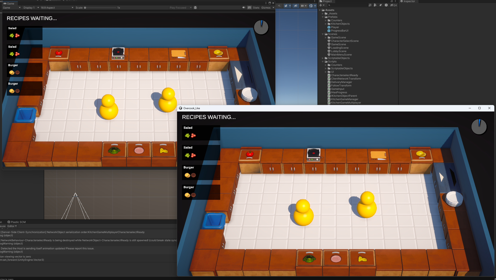
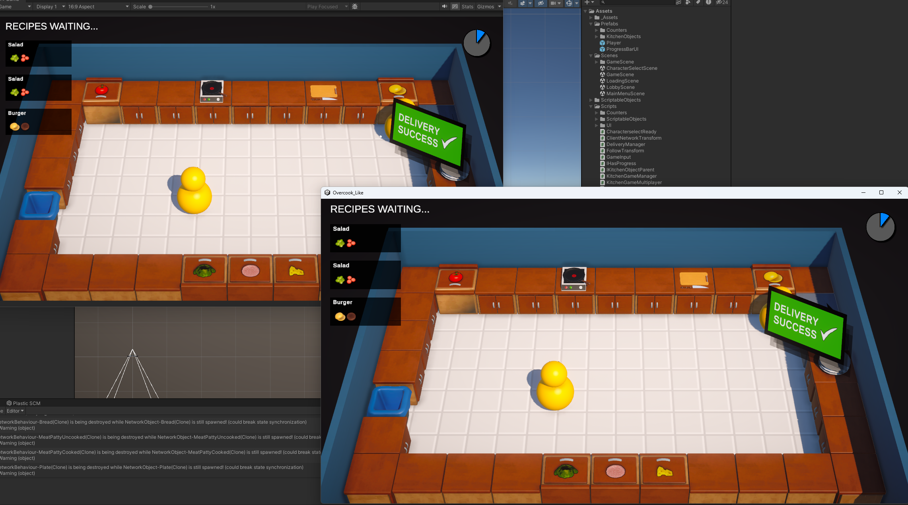
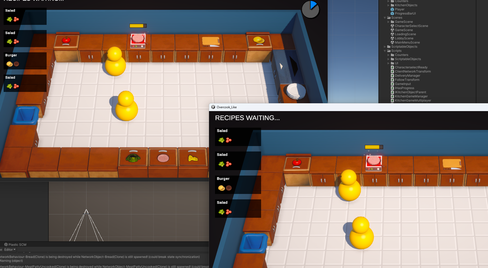

# overcook-like

#### 介绍
仿Overcook的联机游戏
一个学习多人游戏的练习项目
用Unity复刻的Overcook，使用NetCode作为联机解决方案
状态同步+NetCode实现联机,使用Relay+Lobby提供匹配和连接服务设计和实现多人游戏大厅系统,包括玩家匹配和房间管理等功能
实现游戏中的物理和逻辑交互,拾取放置、碰撞检测、制作食物、完成订单、计算得分
借助InputSytem实现多设备绑定

[Tutorial Link](https://www.youtube.com/watch?v=7glCsF9fv3s)

